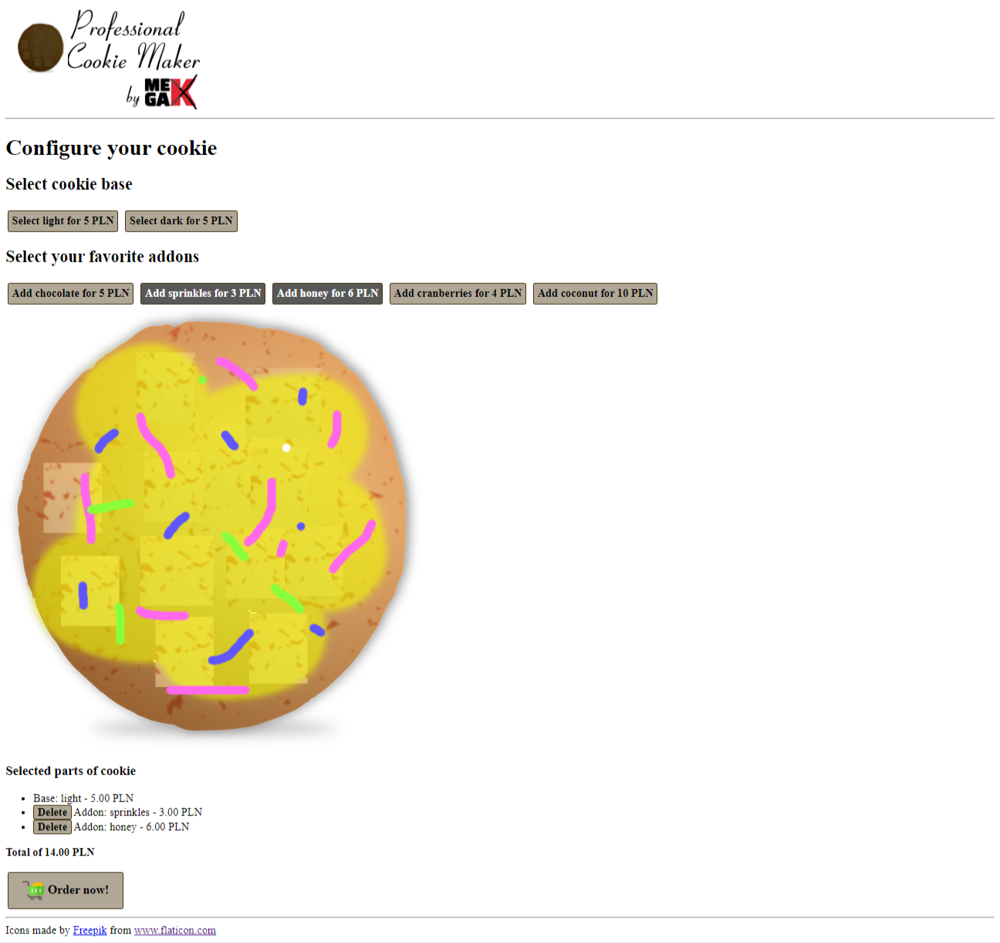

# MegaK-Professional-Cookie-Maker

## Project overview

MegaK-Professional-Cookie-Maker is an exercise to validate skills in Node.js, Express.js and JavaScript.

## Technologies

- HTML
- CSS
- NodeJS
- ExpressJS

## Application View

## Getting Started

### Local Installation (Optional)

If you want to run the project locally on your machine, you will need:

- A web browser
- An internet connection
- Node.js
- Yarn or npm

To install the project locally, follow these steps:

1. Clone the repository: `git clone https://github.com/Wojciech-Podlesny/MegaK-Professional-Cookie-Maker.git`
2. Navigate to the project directory: `cd MegaK-Professional-Cookie-Maker`
3. Install the dependencies: `yarn install` or `npm install`
4. Start the development server: `yarn start` or `npm start`
5. Open your browser and visit `http://localhost:3000` to view the app

## Author

Developed by [Wojciech Podleśny](https://github.com/Wojciech-Podlesny)

## License

This project is licensed under the ISC license.

